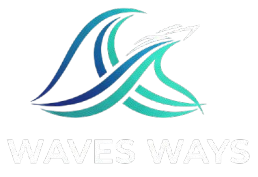

<p align="center">
    
</p>
<p align="center"><h1 align="center">WAVES WAYS</h1></p>
<p align="center">
	<em><code>https://github.com/NicolasTKP/WavesWays</code></em>
</p>
<p align="center">
	
	
	
	
</p>
<p align="center"><!-- default option, no dependency badges. -->
</p>
<p align="center">
	<!-- default option, no dependency badges. -->
</p>
<br>

##  Table of Contents

- [ Overview](#-overview)
- [ Features](#-features)
- [ Project Structure](#-project-structure)

- [ Getting Started](#-getting-started)
  - [ Prerequisites](#-prerequisites)
  - [ Installation](#-installation)
  - [ Usage](#-usage)


- [ License](#-license)
- [ Acknowledgments](#-acknowledgments)

---

##  Overview

**WavesWays** is an innovative *vessel route optimization system* committed to transforming maritime operations through accessible and cost-effective technology. Designed with small and medium-sized vessel operators in mind, WavesWays provides an affordable alternative to enterprise-level systems, enabling independent operators to optimize routes, reduce fuel consumption, and improve overall efficiency. By making advanced route optimization technology more attainable, WavesWays empowers individuals and businesses to navigate smarter and operate more sustainably.

---

##  Features

### Key Features

**Route Optimization** – Automatically generates the most efficient voyage path based on real-time and historical data to reduce travel time and operational costs.

**Dynamic Rerouting** – Continuously monitors weather, sea conditions, and traffic to provide intelligent rerouting suggestions during a voyage.

**Travel Sequence Suggestion** - Suggest the best travel sequence based on TSP algorithm by considering travel distance, weather condition, sea currents, and fuel capacity.

**ETA Calculation** – Accurately predicts the Estimated Time of Arrival using advanced algorithms for improved scheduling and coordination.

**Fuel and Carbon Emission Analysis** – Estimates fuel consumption and carbon output to help operators minimize environmental impact and improve sustainability.

**Vessel Shifting Suggestion** – Utilizes DRL agent to suggest the best vessel heading direction and speed according to the weather and sea currects, act as a guidance in sea, helps to minimizes fuel consumption and carbon emissions.

**Mobile Support** – Fully compatible with mobile devices, allowing users to monitor routes, receive updates, and manage operations anytime, anywhere.

---

##  Project Structure

```sh
└── WavesWays/
    ├── Frontend/
    ├── LICENSE
    ├── README.md
    ├── __pycache__
    ├── api.py
    ├── d_star_lite.py
    ├── data/
    ├── etaModel.py
    ├── models/
    ├── others/
    ├── output/
    ├── package-lock.json
    ├── package.json
    ├── requirements.txt
    ├── test.http
    ├── test.py
    ├── test2.py
    ├── training_codes/
    └── utils.py
```


##  Getting Started

###  Prerequisites

Before getting started with WavesWays, ensure your runtime environment meets the following requirements:

- **Programming Language:** TypeScript, Python
- **Package Manager:** Npm, Pip


###  Installation

Install WavesWays using one of the following methods:

**Build from source:**

1. Clone the WavesWays repository:
```sh
❯ git clone https://github.com/NicolasTKP/WavesWays
```

2. Navigate to the project directory:
```sh
❯ cd WavesWays
```

3. Install the project dependencies:

**Using `pip`** &nbsp; []()

```sh
❯ pip install -r requirements.txt
```

**Using `npm`** &nbsp; [](https://www.npmjs.com/)

```sh
❯ cd Frontend && npm install
```

4. Configure Google Map API:

```sh
❯ cd Frontend
```

Create a file and name it 
```sh
❯ .env
```

In the file write

```sh
❯ VITE_GOOGLE_MAPS_API_KEY=Your_Google_Map_API
```

You have to replace the `Your_Google_Map_API` with your actual google API

5. Download bathymetry data:

Due to the size of the bathymetry data, it is not included in this project, you must manually download it and place it in the `data/Bathymetry/` folder.

It can be download in this link https://www.gebco.net/data-products/gridded-bathymetry-data#global

On the website, you may download the **netCDF** version of **GEBCO_2025 Grid (sub-ice topo/bathy)**

Furthermore, in `data/`, create a folder call `Bathymetry`, and place the **GEBCO_2025_sub_ice.nc** inside it.


###  Usage
The frontend and backend API must be running concurrently in different terminal.

Run WavesWays backend API using the following command:
**Using `pip`** &nbsp; []()

```sh
❯ python -m uvicorn api:app --host 0.0.0.0 --port 8000 --reload
```

Run WavesWays frontend using the following command:
**Using `npm`** &nbsp; [](https://www.npmjs.com/)

```sh
❯ cd Frontend && npm run dev
```

---
##  License

This project is protected under the Test-Only License (No Production, No Commercial, No Personal-Project Use).

---

##  Acknowledgments

- MacyMeiguey
- PeiShan26
- Serene8899
- ShermaineYap

---
