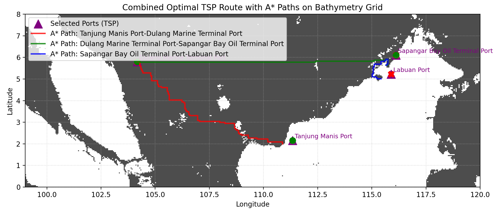

# Vessel Route Optimization System by InternshipSeekers

## Requirements Installation

The following code must be runs in Python environment:

```python
pip install -r requirements.txt
```

## Path Optimization Example

```python
python main.py
```

### The output:


You may freely adjust the vessel statistics for testing

```python
vessel = {
    "speed_knots": 20.0,
    "fuel_consumption_t_per_day": 20.0, # All fuel related stats is in Tons unit
    "fuel_tank_capacity_t": 1000.0,
    "safety_fuel_margin_t": 10.0,
    "fuel_tank_remaining_t": 1000.0, 
    "size": (1000, 500, 60),  #Length, width, height
    "percent_of_height_underwater": 0.3, # How much of vessel body is under the sea surface
}
```

Furthermore, you may also freely adjust the random port generator code under the main execution code, at the bottom of the codes.

```python
selected_ports = ports_gdf.sample(4, random_state=50) # Randomly select 4 ports
```